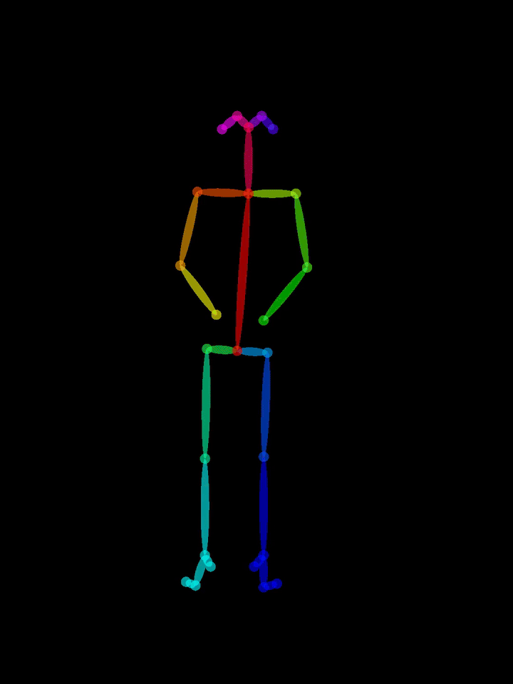
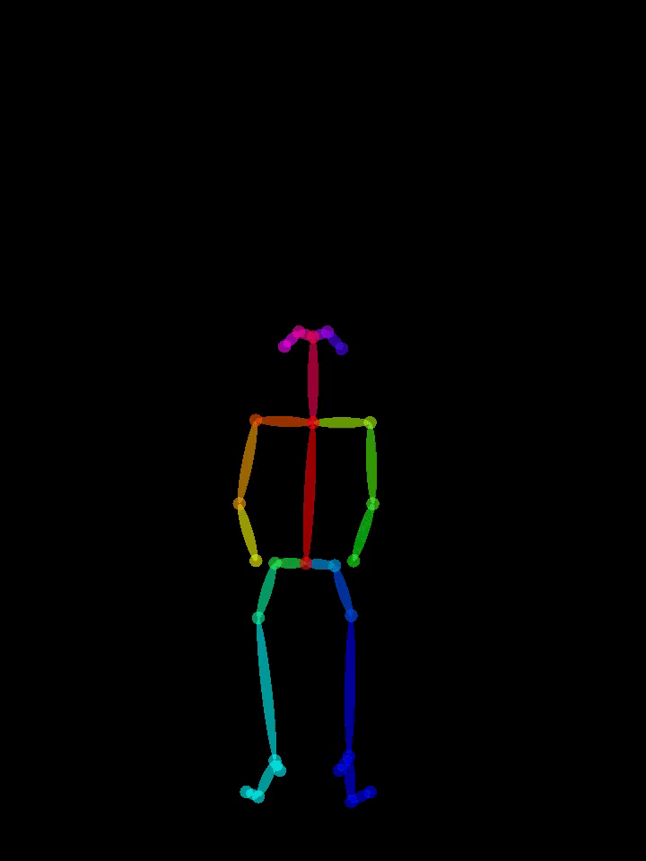

# DSG 动态骨架数据处理要求

本分支仅记录 DSG 的数据范围、划分和预处理接口；未规定模型或训练方案。

## 数据范围与标签

为什么要保留骨架的时间变化？只看某一帧，坐下与起立过程中可能出现相近的姿态；单帧静态特征无法可靠判断动作方向，需要观察关节随时间移动的轨迹。下面两段骨架动画展示了这种区别：

| 坐下（动作示意） | 起立（动作示意） |
|:---:|:---:|
|  |  |

这两段动画仅用于说明时序信息的重要性，不属于下述 DSG 五类动作，也不计入样本数。

DSG 来源于 NTU RGB+D 60 骨架数据集，仅使用 `A059`、`A030`、`A016`、`A005` 和 `A027` 五种动作，并非完整的 NTU RGB+D 60 数据集。

| 标签 | 动作类别 | xsub train | xsub test | xview train | xview test |
|---:|---|---:|---:|---:|---:|
| 0 | A059 walking towards each other | 666 | 273 | 623 | 316 |
| 1 | A030 typing on a keyboard | 669 | 275 | 628 | 316 |
| 2 | A016 wear a shoe | 667 | 273 | 625 | 315 |
| 3 | A005 drop | 667 | 275 | 626 | 316 |
| 4 | A027 jump up | 672 | 276 | 632 | 316 |
| **总计** | **5 类** | **3341** | **1372** | **3134** | **1579** |

## 划分与处理

- `xsub`（Cross-Subject）：按官方受试者名单划分，20 名指定受试者用于训练，其余用于测试。
- `xview`（Cross-View）：摄像机 2、3 的样本用于训练，摄像机 1 的样本用于测试。
- 两种协议从同一份原始数据独立生成；不对官方训练集再次随机按 8:2 切分。
- 输入为 NTU RGB+D 的 `.skeleton` 文件，可放在 `dsg/` 的单一原始目录，也可使用 `dsg/{xsub,xview}/{train,test}/` 已整理的目录。

在项目根目录执行：

```bash
python3 tools/preprocess_datasets.py --datasets dsg
```

如果已经生成过结果，需要覆盖时添加 `--overwrite`。

## 输出接口

生成结果位于 `processed/dsg/`，每个协议的 `train` 和 `test` 都包含下列文件：

```text
processed/dsg/
|-- metadata.json
|-- xsub/
|   |-- train_data.npy
|   |-- train_label.npy
|   |-- train_label.pkl
|   |-- train_samples.txt
|   |-- train_manifest.jsonl
|   `-- test_...（同样的文件类型）
`-- xview/（与 xsub 相同的结构）
```

数据数组为 `float32`，形状 `(N, 3, 300, 25, 2)`，依次表示样本、XYZ 坐标、帧、关节和人体。缺少的帧与人体补零，超过上限的帧与人体截断。`*_label.npy` 为与数据行对应的 `int64` 标签；`*_label.pkl` 保存样本名和标签；`metadata.json` 记录协议、类别映射、划分统计和数据格式。
