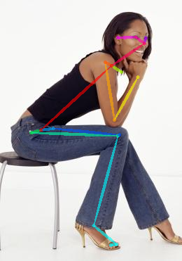
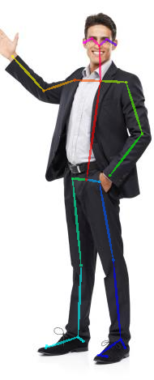

# SSG 静态骨架数据处理要求

将单帧人体关节转换为骨架数据，用于坐姿与站姿分类。

## 问题引入：人体姿态如何表示为图？

一张姿态图像可以用关节点和它们之间的连接来描述：关节点是图的节点，连接是边。下图在坐姿与站姿照片上叠加了骨架，展示同一人体结构在不同姿态下的形状差异。

| 坐姿 | 站姿 |
|:---:|:---:|
|  |  |

图片仅用于说明图表示；预处理输出的是关节坐标与置信度，而非原始照片。关节名称和连接关系记录在输出的 `metadata.json` 中。

## 数据范围与标签

SSG 来源于 POLAR（Posture-level Action Recognition）数据集，只使用原始 9 个姿态类别中的 `sitting` 和 `standing`，并非完整的 POLAR 数据集。

| 标签 | 姿势类别 | train | test |
|---:|---|---:|---:|
| 0 | sitting | 240 | 60 |
| 1 | standing | 237 | 60 |
| **总计** | **2 类** | **477** | **120** |

原始 standing 训练集有 240 个 JSON，其中 3 个没有检测到人体，预处理时跳过，所以生成 237 个 standing 训练样本。

## 输入与预处理

- 输入目录：`ssg/sitting/{train,test}/*.json`、`ssg/standing/{train,test}/*.json`。
- 每个样本使用 OpenPose BODY_25 关节点；存在多个人时选择关节点置信度总和最高的人。
- 对有效关节点进行中心、朝向和尺度归一化；无效关节点的坐标及置信度设为 0。没有有效关节点的样本跳过。
- 保持源数据的 `train`、`test` 划分，不再额外随机切分。

## 快速开始

准备好原始数据后，在项目根目录执行：

```bash
python3 tools/preprocess_datasets.py --datasets ssg
```

已有输出需要重新生成时，添加 `--overwrite`；可以用 `--ssg-min-confidence` 设置参与归一化的最低关节点置信度。

## 输出接口

生成文件位于 `processed/ssg/`：

```text
processed/ssg/
|-- metadata.json
|-- train_data.npy
|-- train_label.npy
|-- test_data.npy
`-- test_label.npy
```

数据数组为 `float32`，形状 `(N, 25, 3)`，最后一维依次是归一化后的 `x`、`y` 和置信度；标签数组为与数据行对应的 `int64`。`metadata.json` 记录类别映射、划分、归一化方式和 BODY_25 关节信息。
