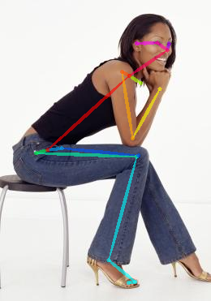
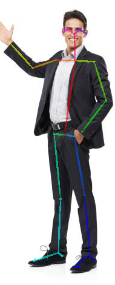

# 静态骨架图实验

- 本实验是课程中的基础图学习任务，以单帧人体骨架的坐姿与站姿二分类为目标，考察学生对人体骨架图表示和基础图分类流程的理解。
- 实验重点考察图神经网络的基本组成与数据流，包括消息传递、邻域特征聚合、图卷积、非线性变换以及图级池化（readout）。学生需要理解节点表示如何沿骨架连接逐层更新，以及如何将多个节点的特征汇聚为整张骨架图的表示并完成分类，为后续时空图学习建立基础。

## 问题引入：人体姿态如何表示为图？

一张姿态图像可以用关节点和它们之间的连接来描述：关节点是图的节点，连接是边。下图在坐姿与站姿照片上叠加了骨架，展示同一人体结构在不同姿态下的形状差异。

| 坐姿 | 站姿 |
|:---:|:---:|
|  |  |

图片仅用于说明图表示；预处理输出的是关节坐标与置信度，而非原始照片。关节名称和连接关系记录在生成的 `processed/ssg/metadata.json` 中。

## 实验目的

- **实验要求**：使用预处理后的单帧`BODY25`骨架完成坐姿与站姿二分类。**主模型必须使用图神经网络**：以 25 个关节为节点，以 `metadata.json` 中的`BODY25`连接关系为边，以归一化后的二维坐标和置信度为节点特征；模型**至少包含一层显式利用骨架边关系的图卷积或等价邻域消息传递模块**，再通过图级池化（readout）得到整张骨架图的特征向量，由分类层输出 `sitting` 或 `standing`。本实验只使用单帧静态信息，不涉及时序建模。

- **建模限制**：原始 `.json`文件和生成的 `.npy` 文件仅作为数据来源与存储接口。训练主模型前，必须将每个样本组织为包含节点特征和边连接的图；**不得跳过图构建**，将关键点或数组直接展平后交给传统机器学习模型、MLP 或 CNN 作为主方案。非图模型可以作为对比基线，但**不能替代主图模型**。

- **评判标准**：最终以固定测试集上的 Top-1 Accuracy 作为主要指标。在满足图建模与提交要求的前提下，固定测试集 Top-1 Accuracy 达到 **80% 及以上**，可视为达到实验性能要求。同时报告 `sitting`、`standing` 两类的 Precision、Recall、F1 和混淆矩阵；当模型准确率接近时，以 Macro-F1 辅助判断两类是否都得到稳定识别。模型之间只能在相同训练集、测试集和预处理条件下比较。

## 实现与工具限制

本实验重点是理解和实现静态骨架图中的邻域特征聚合，而不是通过现成图学习接口直接完成分类。

- **允许使用**：Python、NumPy、PyTorch 的基础张量运算和通用神经网络组件。
- **参考与使用边界**：允许依据论文和公开代码理解、实现、修改与调试图卷积结构，并在报告中注明参考来源。不得直接使用已经封装好图卷积过程或完整图分类模型的第三方图学习库完成实验，例如直接调用 PyTorch Geometric 的 `GCNConv`、`GraphConv`，DGL、Spektral 中的同类图卷积层，或通过 `torch.hub`、第三方 Python 包直接加载完整模型。
- **提交要求**：列出第三方依赖和参考来源，提交完整模型源码、配置、随机种子以及训练与测试命令。

## 数据范围与标签

SSG 来源于 POLAR（Posture-level Action Recognition）数据集，只使用原始 9 个姿态类别中的 `sitting` 和 `standing`，并非完整的 POLAR 数据集。

| 标签 | 姿势类别 | train | test |
|---:|---|---:|---:|
| 0 | sitting | 240 | 60 |
| 1 | standing | 237 | 60 |
| **总计** | **2 类** | **477** | **120** |

原始 standing 训练集有 240 个 JSON，其中 3 个没有检测到人体，预处理时跳过，所以生成 237 个 standing 训练样本。

## 输入与预处理

- 输入目录：`ssg/sitting/{train,test}/*.json`、`ssg/standing/{train,test}/*.json`。
- 每个样本使用 OpenPose BODY_25 关节点；存在多个人时选择关节点置信度总和最高的人。
- 对有效关节点进行中心、朝向和尺度归一化；无效关节点的坐标及置信度设为 0。归一化操作由预处理脚本完成，学生建模时直接使用输出的归一化坐标，无需再次执行相同的归一化。
- 整个样本没有任何有效关节点时由预处理脚本跳过；上文所述 standing 训练集减少的 3 个样本正是因此被跳过。
- 保持源数据的 `train`、`test` 划分，不再额外随机切分。

## 快速开始

准备好原始数据后，在项目根目录执行：

```bash
python3 tools/preprocess_datasets.py --datasets ssg
```

已有输出需要重新生成时，添加 `--overwrite`；可以用 `--ssg-min-confidence` 设置参与归一化的最低关节点置信度。

## 输出接口

结果保存在 `processed/ssg/`：

```text
processed/ssg/
|-- metadata.json
|-- train_data.npy
|-- train_label.npy
|-- test_data.npy
`-- test_label.npy
```

- `train_data.npy` / `test_data.npy`：`float32` 骨架特征，形状为 `(N, 25, 3)`，最后一维依次为归一化后的 `x、y` 坐标和置信度。
- `train_label.npy` / `test_label.npy`：与数据逐样本对应的 `int64` 标签，`0` 表示 `sitting`，`1` 表示 `standing`。
- `metadata.json`：记录数据统计和 `BODY25` 骨架信息；模型应从 `body25.edges` 读取连接关系并构建图。
