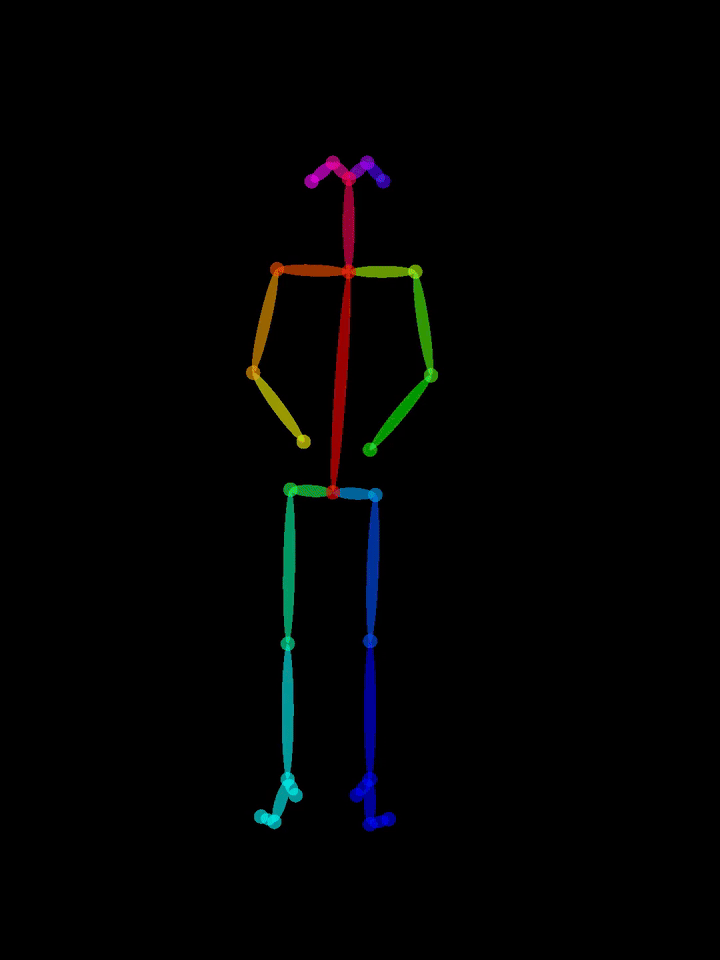
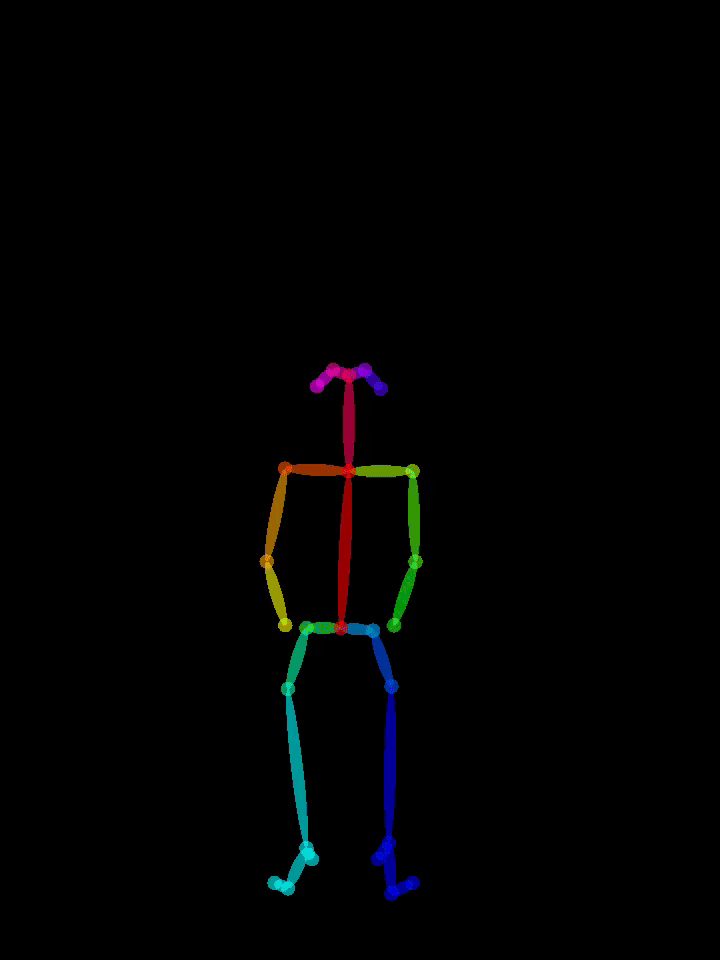

# 动态骨架图实验

本实验是静态骨架图实验的进阶任务，以连续人体骨架序列五分类为目标，要求模型同时学习**帧内关节的空间关系**与**跨帧关节的运动变化**，并结合空间图消息传递、时序建模和动作级聚合完成识别。实验整体难度适中，鼓励同学设计较为完整的动作识别方案，重点理解图神经网络如何由静态骨架图扩展至**时空骨架图**，以及关节特征如何在**空间和时间两个维度上传播**。

## 问题引入：为什么要看动作过程？

只看某一帧，坐下与起立过程中可能出现相近的姿态；要区分动作方向，需要观察关节随时间变化的轨迹。下面两段骨架动画展示了单帧难以表达的时序信息：

| 坐下（动作示意） | 起立（动作示意） |
|:---:|:---:|
|  |  |

动画仅作示意，不属于 DSG 的五类动作，也不计入下方的样本数。

## 实验目的

- **实验要求**：使用预处理后的连续骨架序列训练图模型，识别从 `NTU RGB+D 60` 中抽取的 `A059`、`A030`、`A016`、`A005` 和 `A027` 五类动作。模型应以每帧的 25 个关节为节点，依据人体骨架拓扑进行图卷积或等价的空间消息传递；**跨帧时间变化可使用 TCN、RNN、Attention 或时序消息传递进行建模**。最后通过动作级聚合（readout）得到序列表示，并由分类层完成五分类。`xsub` 和 `xview` 两种官方协议均需独立完成训练与测试。
- **建模限制**：原始 `.skeleton` 文件和生成的 `.npy` 文件仅作为数据来源与存储接口，主模型训练前必须构建帧内关节图和跨帧时间关系。**不得将骨架坐标直接展平后使用传统机器学习**、MLP 或其他不含图结构的模型作为主方案，也不得只进行时间建模而忽略帧内骨架图；非图模型可以作为对比基线。
- **评判标准**：分别报告 `xsub` 和 `xview` 固定测试集上的 Top-1 Accuracy。两种协议的 Top-1 Accuracy **均达到 80% 及以上**，即视为完整完成本实验要求；在此基础上，准确率越高表示分类效果越好。同时报告各类别的 Precision、Recall、F1 和混淆矩阵。需要调参、选择模型或早停时，只能从相应协议的训练集中划分验证集，测试集仅用于最终评估。模型之间只能在相同的数据划分、输入和预处理条件下比较。

## 数据范围与标签

DSG 来源于 NTU RGB+D 60 骨架数据集，仅使用 `A059`、`A030`、`A016`、`A005` 和 `A027` 五种动作，并非完整的 NTU RGB+D 60 数据集。

| 标签 | 动作类别 | xsub train | xsub test | xview train | xview test |
|---:|---|---:|---:|---:|---:|
| 0 | A059 walking towards each other | 666 | 273 | 623 | 316 |
| 1 | A030 typing on a keyboard | 669 | 275 | 628 | 316 |
| 2 | A016 wear a shoe | 667 | 273 | 625 | 315 |
| 3 | A005 drop | 667 | 275 | 626 | 316 |
| 4 | A027 jump up | 672 | 276 | 632 | 316 |
| **总计** | **5 类** | **3341** | **1372** | **3134** | **1579** |

## 划分与预处理

- `xsub`（Cross-Subject）：按官方受试者名单划分，20 名指定受试者用于训练，其余用于测试。
- `xview`（Cross-View）：摄像机 2、3 的样本用于训练，摄像机 1 的样本用于测试。
- 两种协议从同一份原始数据独立生成；如需验证集，应从各协议的训练集中划分，不得改变固定测试集。
- 输入为 NTU RGB+D 的 `.skeleton` 文件，可统一放在 `dsg/` 或 `dsg/nturgb+d_skeletons/` 中，也可使用预先整理好的 `dsg/{xsub,xview}/{train,test}/` 目录结构。

## 快速开始

准备好原始数据后，在项目根目录执行：

```bash
python3 tools/preprocess_datasets.py --datasets dsg
```

已有输出需要重新生成时，添加 `--overwrite`。

## 输出接口

生成结果位于 `processed/dsg/`，每个协议的 `train` 和 `test` 都包含下列文件：

```text
processed/dsg/
|-- metadata.json
|-- xsub/
|   |-- train_data.npy
|   |-- train_label.npy
|   |-- train_label.pkl
|   |-- train_samples.txt
|   |-- train_manifest.jsonl
|   `-- test_...（同样的文件类型）
`-- xview/（与 xsub 相同的结构）
```

- `*_data.npy`：`float32` 骨架序列，形状为 `(N, C, T, V, M) = (N, 3, 300, 25, 2)`。其中 `N` 为样本数，`C` 为按 `x`、`y`、`z` 排列的三维坐标通道，`T` 为帧，`V` 为关节，`M` 为人体。坐标保留原始值，不进行归一化；不足 300 帧或 2 人的位置补零，超出上限的帧和人体截断。
- `*_label.npy`：与 `*_data.npy` 各行一一对应的 `int64` 标签，取值为 `0` 至 `4`，具体映射见上方类别表。
- `*_label.pkl`：二元组 `(sample_names, labels)`，分别保存样本文件名列表及其标签列表。
- `*_samples.txt`：按数据行顺序逐行记录样本文件名。
- `*_manifest.jsonl`：逐样本记录 `sample_name`、协议与划分、动作编号、标签、源文件路径、原始与实际保存帧数、最大人体数、空帧数、被丢弃的人体实例数和处理警告。
- `metadata.json`：记录任务与源数据格式、输入目录组织方式、协议说明、数组格式、类别映射，以及各协议和划分的样本统计、文件路径与处理警告汇总。

预处理生成的 `.npy` 文件和 `metadata.json` **不包含骨架边连接**。帧内图连接应采用 NTU RGB+D 25 关节的官方人体骨架拓扑，并在模型代码中将其构建为邻接矩阵或 `edge_index`；相邻帧之间的时间关系同样需要在模型代码中自行构建。
